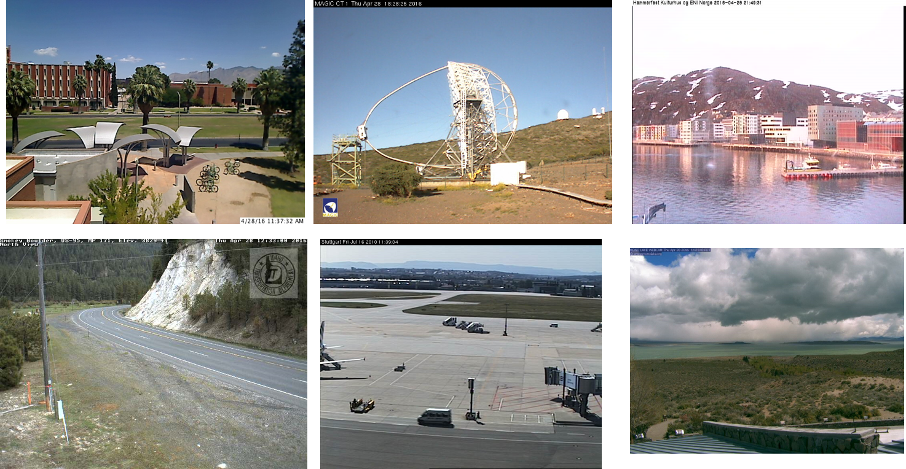
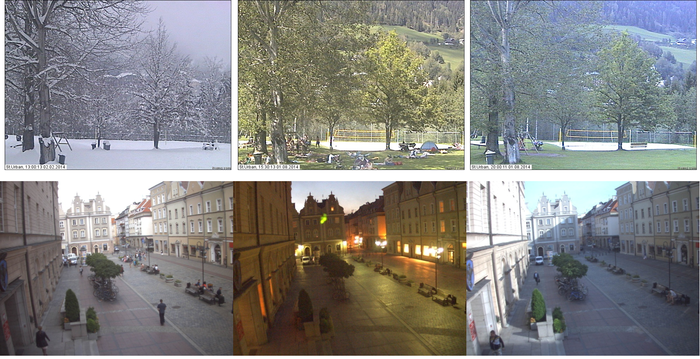

# DLfeature_PlaceRecognition_ICRA2017

This repository provides links to datasets and scripts to extract features using models from the paper "[Deep learning features at scale for visual place recognition](https://ieeexplore.ieee.org/abstract/document/7989366)" published by Zetao Chen, et al. on ICRA 2017. 

## Setup
- Ubuntu
- Follow this guide to [install Caffe](http://caffe.berkeleyvision.org/install_apt.html) library on Ubuntu

## Steps:
- The currently released dataset version can be downloaded [here](https://www.dropbox.com/s/aklu4tz3hurycj0/SPED_900.zip?dl=0) 

- Download the "HybridNet" model from https://goo.gl/kF6nQh and copy them to the folder "HybridNet" in this repository;

- You will need to update the file 'nordland.txt' using the file pathes of your images. Each line in this file specifies one image whose feature is to be extracted. 

- The file 'extract_feat_usingAMOS.py' extract features from the fc7 layer. Update it if you need to extract features from other layers.

- Run the 'extract_feat.sh'

